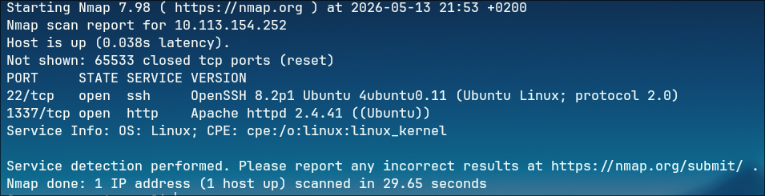
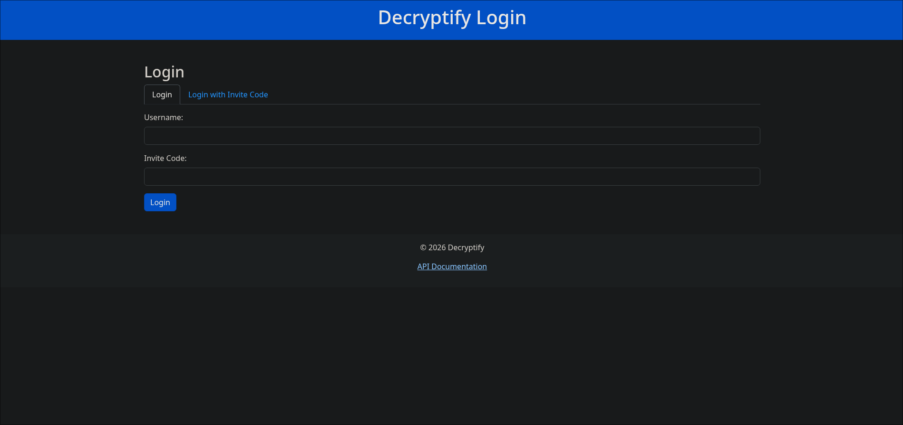
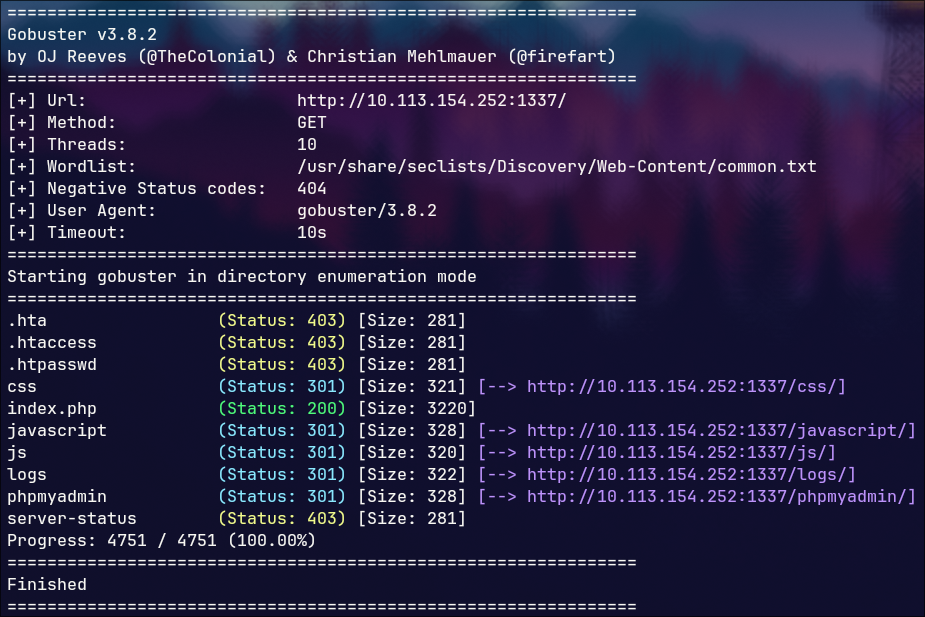
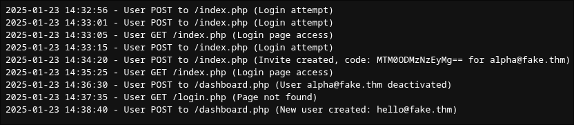
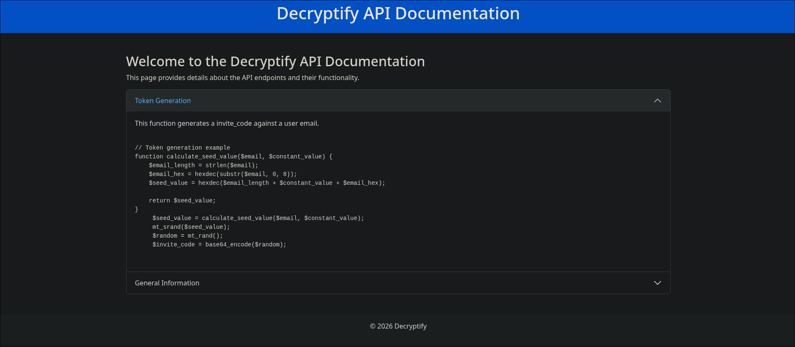
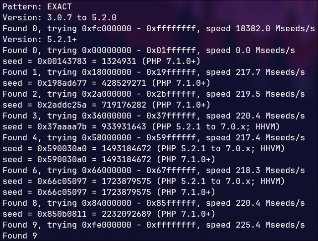
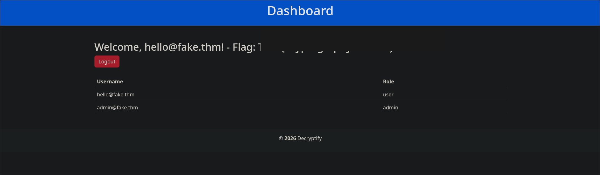
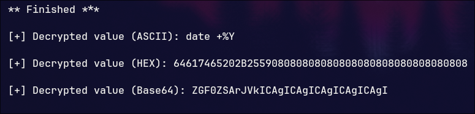
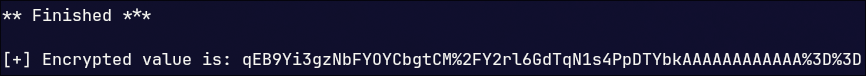

# TryHackMe — Decryptify

**Room:** [Decryptify](https://tryhackme.com/room/decryptify)  
**Difficulty:** Medium  
**Category:** Web / Crypto  
**Flags:** 2

## Introduction

In this room we exploit a web application that uses a weak, predictable token generation scheme based on PHP's Mersenne Twister PRNG. Once inside the dashboard, we leverage a **padding oracle vulnerability** to forge an encrypted command and retrieve the final flag.

## Reconnaissance

First we scan the machine for open ports with nmap, we usually use:
```
sudo nmap -sS -sV -T4 -p- IP
```
for a quick, whole and in detail scan.

We got port **22** open (SSH), and **1337** (Apache server).



Opening in the browser, we get a login page.



We can see there is an option for login, and login with invite code. We could try bruteforcing this but that wouldn't be smart as we don't yet know anything.

## Web Enumeration

Then we run gobuster to try and find some directories or pages.



In gobuster's output we can see some interesting directories: **logs**, **javascript** and **js**.

We immediately go into the **logs** directory, and there's a file with logs from login attempts to the website.



We can see two emails appearing, and for the first one **alpha@fake.thm** we can see a code is given to it. In total we see two emails, **alpha@fake.thm** and **hello@fake.thm**. The code is a base64 encoded 10 digit number, looks random. We tried putting the corresponding email and code on the login page, but it says that the account is deactivated, which we could see from the log entries.

Then we start exploring a bit more, and go to the **js** folder, where we found a file called **api.js** and inside it was:
```
function b(c,d){const e=a();return b=function(f,g){f=f-0x165;let h=e[f];return h;},b(c,d);}const j=b;function a(){const k=['16OTYqOr','861cPVRNJ','474AnPRwy','H7gY2tJ9wQzD4rS1','5228dijopu','29131EDUYqd','8756315tjjUKB','1232020YOKSiQ','7042671GTNtXE','1593688UqvBWv','90209ggCpyY'];a=function(){return k;};return a();}(function(d,e){const i=b,f=d();while(!![]){try{const g=parseInt(i(0x16b))/0x1+-parseInt(i(0x16f))/0x2+parseInt(i(0x167))/0x3*(parseInt(i(0x16a))/0x4)+parseInt(i(0x16c))/0x5+parseInt(i(0x168))/0x6*(parseInt(i(0x165))/0x7)+-parseInt(i(0x166))/0x8*(parseInt(i(0x16e))/0x9)+parseInt(i(0x16d))/0xa;if(g===e)break;else f['push'](f['shift']());}catch(h){f['push'](f['shift']());}}}(a,0xe43f0));const c=j(0x169);
```
Looks like something obfuscated. We deobfuscate the code on deobfuscate.io and notice there is something being saved to a variable `c`. We run the code in the browser console and print out the `c` variable — we get the password **H7gY2tJ9wQzD4rS1**.

We go back to the login page, where there's a link for **API documentation**. After clicking on it, it asks for a password. After putting in the password we just found, we get in. We get a page with PHP code explaining how the access token generation works.



## Reversing the Token Generator

### Understanding the Algorithm

After taking a close look at the code we can make out what it does. It generates an access token for a given email, and the steps are as follows:

1. Take the **first 8 characters** of the email.
2. Keep only the **hex-valid characters** (0–9, a–f) and discard the rest.
3. Convert the remaining hex string to a decimal number (*hexdec*).
4. Sum the **constant**, the **email length**, and the *hexdec* result from step 3.
5. Treat that sum *as a hex string* and convert it to decimal — this becomes the **seed** for `mt_srand()`.
6. Generate a random number with `mt_rand()`, **base64 encode** it — this is the final access token.

```
// Token generation example
function calculate_seed_value($email, $constant_value) {
    $email_length = strlen($email);
    $email_hex = hexdec(substr($email, 0, 8));
    $seed_value = hexdec($email_length + $constant_value + $email_hex);

    return $seed_value;
}

    $seed_value = calculate_seed_value($email, $constant_value);
    mt_srand($seed_value);
    $random = mt_rand();
    $invite_code = base64_encode($random);
```

For example, with **alpha@fake.thm**: it takes **alpha@fa**, discards the non-hex characters — *l*, *p*, *h*, *@* — leaving *aafa*, which is converted to decimal.

### Recovering the Constant

What can we do with this? We have the email **alpha@fake.thm** and its access code from the logs — we can try reverse-engineering this function to get the **constant**, which is always the same for every user.

`mt_srand` and `mt_rand` are Mersenne Twister functions for generating pseudo-random numbers. Given the first random number produced by `mt_rand()`, can we recover the seed used to generate it? Yes — and there is a tool for that over on [php_mt_seed](https://github.com/openwall/php_mt_seed).

After cloning the repo and building the program, we first **base64 decode** the access token from the logs to get the raw number, then run:
```
./php_mt_seed <decoded_number>
```

It ran for a bit and gave us 9 possible seeds, with 2 pairs of duplicates — so **7 unique candidates**.



So which seed to use? Remembering how the seed is generated — a decimal number that is treated as a hex string, which is then converted to decimal — we are looking for a candidate that, when converted to hex, **contains only decimal digits** (0–9), with no hex letters (a–f). As it turns out, only the first seed matches that constraint, so we go with that one.

Now we need to recover the constant. We convert that seed to hex, interpret that hex as a decimal number, and solve:
`email_length + hexdec_email + constant = seed_hex_as_decimal`

Using **alpha@fake.thm**, we easily get the constant: **99999**.

### Generating the Token for hello@fake.thm

Now after we have the constant, we compute the access token for the other email address. For **hello@fake.thm**, the first 8 characters are *hello@fa*, the hex digits are *e*, *f*, *a* → *efa*, which is **3834**.

```python
const = 99999
# for hello@fake.thm
hexdec_mail = 3834
len_mail = 14

seed = int(str(const + len_mail + hexdec_mail), 16)
print(seed)
```

With the seed computed, we generate the access token by running:
```
php -r "mt_srand(seed); echo mt_rand();"
```

We base64 encode the resulting number and use it as the access code for logging in with the **hello@fake.thm** email, and we get to the dashboard where we get our first flag.



## Padding Oracle Attack

Here we see another account — **admin@fake.thm**. Can we maybe try to get his access code? Nope, tried it and it didn't work. But inspecting the page source we stumble onto something interesting:
```html
<form method="get">
    <input type="hidden" name="date" value="H5gVprXqVGDaYGWRTVhHniMpxonYVV8EZHEs3OQASYs=">
</form>
```

Naturally we try to base64 decode this, but it is garbage — it's encrypted. We try putting that value in the *date* GET parameter and get a padding error. This is a classic sign of a **padding oracle vulnerability**.

A padding oracle attack works in two phases:
1. **Decryption** — the tool manipulates individual bytes of the ciphertext and sends them to the server, observing whether the response is a padding error or not. By doing this systematically for each byte, it recovers the original plaintext without ever knowing the key.
2. **Encryption** — once we understand the oracle's behavior, the tool works in reverse to encrypt *our own* chosen plaintext into a ciphertext the server will accept and execute.

There is a tool for this: **padbuster**. We first run it to decrypt the hidden value and see what command the server is executing:
```
padbuster 'http://IP:1337/dashboard.php?date=enc_string' "enc_string" 8 -encoding 0 --cookies "PHPSESSID=YOUR_PHPSESSID"
```

After letting it run, it outputs the decrypted string.



So it executes **`date +%Y`** to output the current year on the dashboard. We can now encrypt our own command and pass it as the `date` parameter. Since the flag is in */home/ubuntu/flag.txt*, we run:
```
padbuster 'http://IP:1337/dashboard.php?date=enc_string' "enc_string" 8 -encoding 0 --cookies "PHPSESSID=YOUR_PHPSESSID" --plaintext "cat /home/ubuntu/flag.txt"
```

This outputs the encrypted string for our command.



We take this encrypted string and paste it into the *date* GET parameter — `http://IP:1337/dashboard.php?date=enc_string` — and instead of the year, the flag is printed on the dashboard.

## Conclusion

This room chained together a few different vulnerability classes in a satisfying way. The first half was about understanding and reversing a custom token generation scheme — recognizing that PHP's `mt_rand()` is a Mersenne Twister and that its output can be reversed to recover the seed, then using that seed to derive a secret constant and forge a valid token for a different account. The second half was a classic padding oracle attack, exploiting the server leaking padding errors to both decrypt an unknown ciphertext and re-encrypt an arbitrary command.

**Techniques used:**
- Port scanning with **nmap**
- Directory enumeration with **gobuster**
- JavaScript deobfuscation
- PHP Mersenne Twister seed recovery with **php_mt_seed**
- Padding oracle attack with **padbuster**
